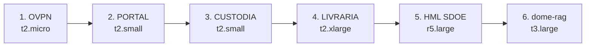

# Plano de Migração Graviton — Passo a Passo

**Data:** 06/05/2026
**Objetivo:** Migrar 6 instâncias EC2 de x86 para ARM64 (Graviton), economizando ~US$ 100/mês.

---

## Como Funciona Este Plano

- Migrações **sequenciais**, uma máquina por vez
- Você (Fernando) me dá o "**go [nome-da-máquina]**" quando estiver pronto pra trabalhar nela
- Eu provisiono a nova instância e te passo IP/credenciais
- Você loga via SSH e executa os passos de instalação/migração
- Eu te guio em cada comando
- Mantemos a máquina antiga **stopped por 7 dias** após cutover (rollback)
- Depois de validado, eu termino a antiga

---

## Recursos Comuns

| Item | Valor |
|---|---|
| Região | us-east-1 |
| AMI Amazon Linux 2023 ARM64 | `ami-0ba0530c9fb19da2f` |
| AMI Ubuntu 24.04 ARM64 (alternativa) | `ami-0953e2223326856ce` |
| Key SSH (mesma do open-api-back) | `open-api-back.pem` ou criar nova específica |

---

## Ordem Recomendada



Começa pelas mais simples e baratas (validar o procedimento) antes de tocar nas mais críticas.

---

## Framework Genérico (válido pra todas)

Para cada máquina, o fluxo é o mesmo:

### Passo 1 — Pré-flight (eu faço)

```bash
# Snapshot da instância atual (rollback insurance)
aws ec2 create-image --instance-id i-XXX --name "BACKUP-PRE-GRAVITON-<nome>-2026-05-06" --no-reboot

# Inventário rápido via API
aws ec2 describe-instances --instance-ids i-XXX
aws ec2 describe-volumes --filters Name=attachment.instance-id,Values=i-XXX
```

### Passo 2 — Provisionar nova máquina ARM (eu faço)

```bash
aws ec2 run-instances \
  --region us-east-1 \
  --image-id ami-0ba0530c9fb19da2f \
  --instance-type <NEW_TYPE> \
  --subnet-id <SAME_SUBNET_AS_OLD> \
  --security-group-ids <SAME_SG_AS_OLD> \
  --key-name <KEY_NAME> \
  --tag-specifications 'ResourceType=instance,Tags=[{Key=Name,Value=<NOVO_NOME>-arm}]' \
  --metadata-options HttpTokens=required \
  --block-device-mappings 'DeviceName=/dev/xvda,Ebs={VolumeSize=<SAME_SIZE>,VolumeType=gp3,DeleteOnTermination=true}'
```

### Passo 3 — Você loga na nova e instala o stack

```bash
# Atualizar
sudo dnf update -y

# Pacotes básicos (ajustar por máquina)
sudo dnf install -y nginx git nodejs npm htop

# Para apps Java (DocPro, Pitang etc):
sudo dnf install -y java-21-amazon-corretto

# Para apps Node:
# já vem com dnf install nodejs

# Para Python:
sudo dnf install -y python3 python3-pip
```

### Passo 4 — Migrar dados/configs (você faz, eu posso scriptar)

```bash
# Da antiga pra nova (rsync, executado da NOVA puxando):
rsync -avz -e "ssh -i ~/.ssh/key.pem" ec2-user@<IP_VELHA>:/etc/nginx/conf.d/ /etc/nginx/conf.d/
rsync -avz -e "ssh -i ~/.ssh/key.pem" ec2-user@<IP_VELHA>:/var/www/ /var/www/
rsync -avz -e "ssh -i ~/.ssh/key.pem" ec2-user@<IP_VELHA>:/opt/<app>/ /opt/<app>/

# Crontabs
ssh -i ~/.ssh/key.pem ec2-user@<IP_VELHA> "sudo crontab -u root -l" | sudo crontab -u root -

# Variáveis de ambiente / .env
scp -i ~/.ssh/key.pem ec2-user@<IP_VELHA>:/opt/<app>/.env /opt/<app>/.env
```

### Passo 5 — Validar funcionamento

```bash
# Health checks específicos do app
curl -sS http://localhost/health
systemctl status <servico>
journalctl -u <servico> -n 50

# Testar de fora também
curl -sS https://<dns-temporário-ou-ip-novo>/
```

### Passo 6 — Cutover DNS/EIP

**Opção A: Trocar Elastic IP** (mais rápido, sem propagação DNS)

```bash
# Identifica EIP atual da antiga
aws ec2 describe-addresses --filters Name=instance-id,Values=i-OLD

# Disassocia da antiga
aws ec2 disassociate-address --association-id <ASSOC_ID>

# Associa na nova
aws ec2 associate-address --instance-id i-NEW --allocation-id <ALLOC_ID>
```

**Opção B: Atualizar DNS Route53** (se não usa EIP)

```bash
# Pegar zona
aws route53 list-hosted-zones-by-name --dns-name cepe.com.br

# Trocar A record
aws route53 change-resource-record-sets --hosted-zone-id Z... --change-batch ...
```

### Passo 7 — Stop antiga (mantém 7 dias)

```bash
aws ec2 stop-instances --instance-ids i-OLD
```

### Passo 8 — Terminate antiga (após 7 dias OK)

```bash
aws ec2 terminate-instances --instance-ids i-OLD
```

---

## 1️⃣ CEPEBR-OVPN-SDOE — Mais Fácil

| Item | Valor |
|---|---|
| Instance ID | `i-0bd5e5ce0a35079fb` |
| Tipo atual | t2.micro (1 vCPU, 1 GB RAM, x86) — `~$8/mês` |
| Tipo alvo | **t4g.micro** (2 vCPU, 1 GB RAM, ARM) — `~$6/mês` |
| Economia | ~$2/mês |
| Stack | OpenVPN Community Edition (existe build ARM oficial) |
| Risco | Baixo — perda momentânea de VPN durante cutover |
| Tempo estimado | 30-60 min |

### Especificidades

- OpenVPN tem package `openvpn` no repo Amazon Linux ARM64
- Migrar `/etc/openvpn/server.conf` + `/etc/openvpn/server/` (chaves, certs, ca.crt, dh.pem, server.crt, server.key)
- Se usa easy-rsa, copiar `/etc/openvpn/easy-rsa/`
- Reativar serviço: `systemctl enable --now openvpn-server@server`
- Cutover: trocar EIP — clientes VPN vão reconectar automaticamente

### Passos comandados

```bash
# Você no VPN-velha:
sudo tar czf /tmp/ovpn-config.tgz /etc/openvpn /var/log/openvpn

# Da nova:
sudo dnf install -y openvpn easy-rsa
scp -i key.pem ec2-user@VPN_VELHA:/tmp/ovpn-config.tgz .
sudo tar xzf ovpn-config.tgz -C /
sudo systemctl enable --now openvpn-server@server
sudo systemctl status openvpn-server@server
```

---

## 2️⃣ CEPEBR-PORTAL

| Item | Valor |
|---|---|
| Instance ID | `i-0bfbd27a679f6c964` |
| Tipo atual | t2.small (1 vCPU, 2 GB RAM) — `~$17/mês` |
| Tipo alvo | **t4g.small** (2 vCPU, 2 GB RAM, ARM) — `~$13/mês` |
| Economia | ~$4/mês |
| Stack | A confirmar (provavelmente nginx + app web) |
| Risco | Baixo |
| Tempo estimado | 1h |

**Antes de começar, preciso saber:** o que está instalado no PORTAL? (nginx? PHP? Node? Java? Static?). Vou perguntar quando você der o "go".

---

## 3️⃣ CEPEBR-CUSTODIA

| Item | Valor |
|---|---|
| Instance ID | `i-03f2a6562e436585b` |
| Tipo atual | t2.small (1 vCPU, 2 GB RAM) — `~$17/mês` |
| Tipo alvo | **t4g.small** (2 vCPU, 2 GB RAM, ARM) — `~$13/mês` |
| Economia | ~$4/mês |
| Stack | App de custódia digital (a confirmar) |
| Risco | Baixo |
| Tempo estimado | 1h |

---

## 4️⃣ CEPEBR-LIVRARIA

| Item | Valor |
|---|---|
| Instance ID | `i-0bf4104b762656187` |
| Tipo atual | t2.xlarge (4 vCPU, 16 GB RAM) — `~$134/mês` |
| Tipo alvo (como está) | t4g.xlarge — `~$110/mês` |
| **Tipo alvo + rightsize** | **t4g.large** (2 vCPU, 8 GB RAM) — `~$54/mês` se for under-utilized |
| Economia | ~$24/mês (mesmo size) ou **~$80/mês** (com rightsize) |
| Stack | A confirmar — provavelmente e-commerce + DB local? |
| Risco | Médio (rightsize precisa validar carga) |
| Tempo estimado | 1-2h |

**Recomendação:** olhar CloudWatch metrics dos últimos 30d antes de decidir o size novo. Se CPU max < 30% e RAM < 50%, t4g.large é suficiente.

---

## 5️⃣ SDOE_HML_030223 (Homologação)

| Item | Valor |
|---|---|
| Instance ID | `i-04584012553f8a996` |
| Tipo atual | r5.large (2 vCPU, 16 GB RAM) — `~$95/mês` |
| Tipo alvo (como está) | r7g.large — `~$80/mês` |
| **Tipo alvo + rightsize** | **t4g.large** (2 vCPU, 8 GB RAM) — `~$54/mês` se 16 GB for excesso |
| Tipo alvo + rightsize agressivo | **t4g.medium** (2 vCPU, 4 GB) — `~$27/mês` |
| Economia (com stop scheduler já ativo + rightsize) | **~$70/mês** |
| Stack | Espelho do produção SDOE (Java + DB?) |
| Risco | Baixo (é HML, errar é OK) |
| Tempo estimado | 2-3h |

**Já tem stop scheduler ativo** (criado ontem) — só ligado em horário comercial.

**Validar:** uso real de RAM/CPU em homolog. HML normalmente subutiliza recursos.

---

## 6️⃣ dome-rag-gpu

| Item | Valor |
|---|---|
| Instance ID | `i-09390eeab3c804869` |
| Tipo atual | t3.large (2 vCPU, 8 GB RAM) — `~$60/mês` |
| Tipo alvo | **t4g.large** (2 vCPU, 8 GB RAM, ARM) — `~$54/mês` |
| Economia | ~$6/mês |
| Stack | "dome-rag" (RAG = Retrieval Augmented Generation? IA?). Apesar do nome `gpu`, é t3 sem GPU. Talvez seja CPU-only. |
| Risco | **A investigar** — se usa biblioteca CUDA/x86-only (numpy MKL, etc), não migra |
| Tempo estimado | 1-2h |

**Antes:** verificar `pip list` na máquina atual. Se tem `torch`, `tensorflow`, `numpy` com MKL → pode ter problemas em ARM (mas geralmente tem builds ARM agora).

---

## Total

| Métrica | Valor |
|---|---|
| Instâncias a migrar | 6 |
| Economia conservadora (mesmo size) | ~US$ 60/mês = US$ 720/ano |
| Economia com rightsize (Livraria + HML) | **~US$ 130-150/mês** = **~US$ 1.700/ano** |
| Tempo total estimado (sequencial) | 6-12 horas (distribuídas em janelas) |

---

## Como começar

Quando estiver pronto pra primeira migração, me diz:

> **"go ovpn"**  (ou portal, custodia, livraria, hml, dome-rag)

Eu vou:
1. Tirar snapshot da máquina atual
2. Provisionar a nova instância t4g/r7g
3. Te passar IP + comando de SSH
4. Te guiar passo a passo até cutover

Se travar em algum comando, é só me chamar.

---

*Documento gerado em 06/05/2026 — atualização sempre que uma migração for concluída.*
