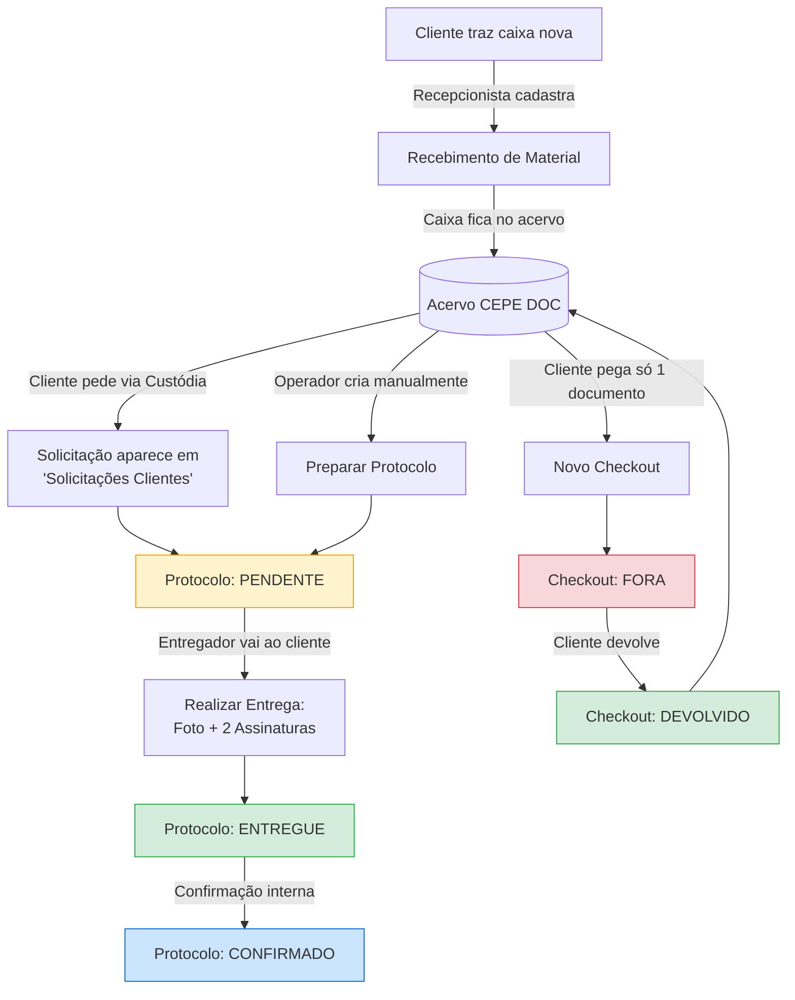
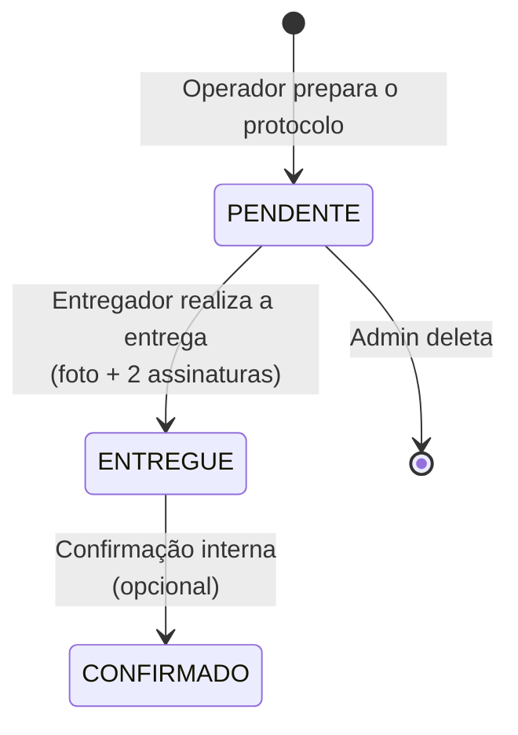
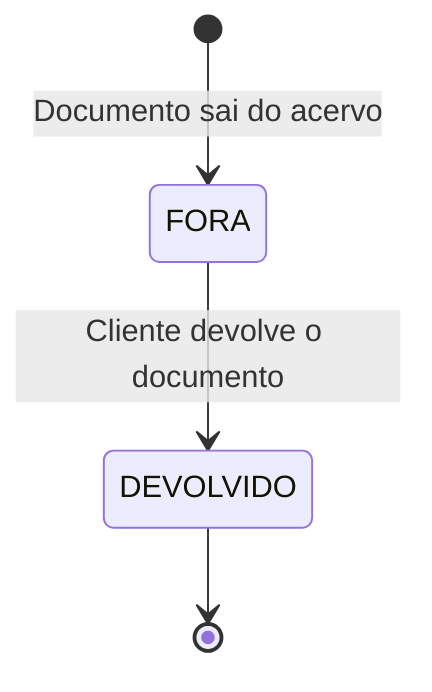
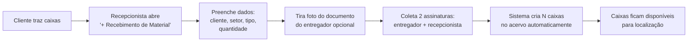
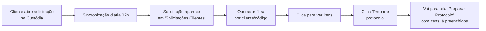

# Manual do Usuário — CEPE DOC Protocolo Online

> **Para quem é este manual:** funcionários do CEPE DOC que vão usar o sistema Protocolo no dia a dia (recepcionistas, entregadores, operadores e administradores).
> **Tipo de aplicação:** PWA (Progressive Web App) — funciona no navegador do celular ou computador, e continua funcionando mesmo sem internet.
> **URL:** https://outros-protocolo.vuhdol.easypanel.host/

---

## Índice

1. [Visão geral do sistema](#1-visão-geral)
2. [Primeiro acesso](#2-primeiro-acesso)
3. [Conhecendo a tela inicial](#3-conhecendo-a-tela-inicial-dashboard)
4. [O fluxo completo](#4-o-fluxo-completo-em-uma-imagem)
5. [Módulo: Recebimento de Material](#5-módulo-recebimento-de-material)
6. [Módulo: Solicitações Clientes](#6-módulo-solicitações-clientes)
7. [Módulo: Preparar Protocolo (manual)](#7-módulo-preparar-protocolo-manual)
8. [Módulo: Realizar Entrega](#8-módulo-realizar-entrega)
9. [Módulo: Checkouts de Documentos](#9-módulo-checkouts-de-documentos)
10. [Módulo: Relatórios](#10-módulo-relatórios)
11. [Módulo: Gerenciar Usuários (admin)](#11-módulo-gerenciar-usuários-admin)
12. [Trabalhando offline](#12-trabalhando-offline)
13. [Perguntas frequentes](#13-perguntas-frequentes)
14. [Glossário](#14-glossário)

---

## 1. Visão geral

O **Protocolo Online** é o sistema oficial do CEPE DOC para registrar a movimentação física de documentos e caixas — quando entram, saem, são entregues a clientes e devolvidos ao acervo.

Ele se conecta com o **Custódia** (sistema de gestão documental do CEPE) para receber demandas e consultar onde cada caixa está armazenada.

### O que dá pra fazer no sistema

| Operação | Quando usar |
|---|---|
| **Recebimento de Material** | Quando o cliente traz caixas novas para serem guardadas no acervo |
| **Solicitações Clientes** | Quando o cliente pede no Custódia que uma caixa seja entregue |
| **Preparar Protocolo** | Quando você precisa criar uma entrega ou transferência sem partir de uma solicitação |
| **Realizar Entrega** | Quando o entregador leva as caixas até o cliente — coleta assinatura e foto |
| **Checkout de Documento** | Quando o cliente pega um documento individual (não a caixa toda) emprestado |
| **Relatórios** | Para ver tempo médio de entrega, status, totais por cliente, período |

### Tema visual

- Cor principal: **verde escuro** (`#00593b`) — identidade do CEPE DOC
- Logo do CEPE no canto superior esquerdo
- O nome do usuário aparece no canto direito, junto com o botão **Sair**
- Indicadores no topo: **status online/offline** e **última sincronização**

---

## 2. Primeiro acesso

### 2.1. Quem libera seu cadastro

Pessoas com perfil **administrador** liberam novos usuários. Se você é novo no CEPE DOC, peça à administração para criar sua conta. Você vai receber:

- **E-mail de cadastro** (será seu login)
- **Senha temporária**

### 2.2. Como entrar

1. Acesse https://outros-protocolo.vuhdol.easypanel.host/
2. Digite e-mail e senha
3. Clique em **Entrar**

> 💡 **Dica:** abra o link no celular e adicione à tela inicial — o sistema funciona como um aplicativo, inclusive offline. No Chrome do Android, vá em **⋮ → Adicionar à tela inicial**. No iPhone (Safari), use **Compartilhar → Adicionar à Tela de Início**.

### 2.3. Trocar senha

Após o primeiro login, peça ao administrador para resetar sua senha (no momento, a troca é feita pela equipe admin no menu **Gerenciar Usuários**).

---

## 3. Conhecendo a tela inicial (Dashboard)

Depois do login você cai na tela inicial. Ela é dividida em duas seções:

```
┌──────────────────────────────────────────────────────────┐
│  CEPE DOC  Protocolo  [online]    🔄 sync  Fernando  Sair │
├──────────────────────────────────────────────────────────┤
│                                                          │
│   Estatísticas (clicáveis):                              │
│   ┌─────┐ ┌──────────┐ ┌──────────┐ ┌─────────────────┐  │
│   │Total│ │Pendentes │ │Entregues │ │Não-sincronizados│  │
│   │ 234 │ │    18    │ │   210    │ │       0         │  │
│   └─────┘ └──────────┘ └──────────┘ └─────────────────┘  │
│                                                          │
│   ━━━ Protocolos ━━━                                     │
│   [ 📋 Solicitações Clientes  ]  ← demandas do Custódia  │
│   [ ➕ Preparar Protocolo     ]  ← criar entrega manual  │
│   [ 📑 Protocolos             ]  ← lista todos           │
│   [ 👥 Gerenciar Usuários     ]  ← só admin             │
│                                                          │
│   ━━━ Recebimento e Checkout ━━━                         │
│   [ ➕ Recebimento de Material ]  ← caixa nova entra     │
│   [ 📦 Recebimentos           ]  ← histórico             │
│   [ 📤 Checkouts de Documentos]  ← empréstimos           │
│                                                          │
└──────────────────────────────────────────────────────────┘
```

Os 4 cartões de estatísticas no topo permitem **filtrar a tela de Protocolos** rapidamente — clicar em "Pendentes" leva para a lista filtrada por status pendente.

---

## 4. O fluxo completo em uma imagem

A vida típica de uma caixa/documento no sistema:



### Estados do Protocolo de Entrega



### Estados do Checkout



---

## 5. Módulo: Recebimento de Material

**Quando usar:** o cliente trouxe caixas novas e elas precisam ser cadastradas no acervo.

### Quem faz

Qualquer usuário autenticado (tipicamente **recepcionista**).

### Como funciona



### Passo a passo

1. No Dashboard, clique em **➕ Recebimento de Material**
2. Selecione o **Cliente** (campo com busca textual — digite parte do nome)
3. Selecione o **Setor** do cliente (carrega automaticamente após escolher o cliente)
4. Escolha o **Tipo de Objeto** (Caixa, Pasta, etc.)
5. Informe a **Quantidade de caixas** que estão sendo recebidas
6. (Opcional) Nome do **entregador** que trouxe e número do documento de identidade
7. (Opcional) Bata uma **foto do documento** do entregador
8. (Opcional) Coletar **assinaturas** (entregador + recepcionista do CEPE)
9. (Opcional) **Observações** livres
10. Clique em **Salvar Recebimento**

### O que acontece nos bastidores

- Sistema gera um **número de recebimento** (ex: `R20260504001`)
- Cria N **objetos** no acervo (status inicial: "EM" — em armazenagem)
- Vincula tudo ao recebimento via tabela de caixas
- O recebimento fica visível em **📦 Recebimentos**

### Localizar caixas depois do recebimento

Em **📦 Recebimentos → [escolher recebimento]**, é possível atualizar a **localização física** (estante, prateleira) de cada caixa individualmente.

---

## 6. Módulo: Solicitações Clientes

**Quando usar:** o cliente abriu uma solicitação no Custódia pedindo entrega de caixas — ela aparece automaticamente aqui.

### Como funciona



### Passo a passo

1. Dashboard → **📋 Solicitações Clientes**
2. Use os filtros do topo:
   - **Cliente** (autocomplete)
   - **Código da solicitação** (se você sabe o número)
   - **Ordenação por data**
3. Role a lista (rolagem infinita carrega mais conforme você desce)
4. Clique numa solicitação para ver os **itens** (caixas/documentos pedidos)
5. Para entregar, clique em **Preparar Protocolo a partir desta solicitação**

> 💡 **Por que não vejo solicitação X?** Pode ser que a sincronização diária ainda não rodou. Sincronizações acontecem todos os dias às 02:00. Em caso de urgência, peça a um administrador para rodar a sincronização manual.

---

## 7. Módulo: Preparar Protocolo (manual)

**Quando usar:** quando você precisa criar um protocolo sem partir de uma solicitação do Custódia (ex: transferência interna entre setores).

### Tipos de protocolo

| Tipo | Para quê |
|---|---|
| **Entrega** | Levar caixas/documentos ao cliente externo |
| **Transferência** | Mover caixas internamente entre setores ou armazéns |

### Passo a passo

1. Dashboard → **➕ Preparar Protocolo**
2. Escolha o **Tipo** (Entrega ou Transferência)
3. Selecione o **Cliente** (autocomplete)
4. **Adicione caixas**:
   - **Manualmente:** digite o código de cada caixa
   - **Pelo scanner:** clique no ícone de câmera para ler **código de barras** ou **QR-code** das caixas — economiza tempo e evita erro
5. (Opcional) **Descrição** de cada caixa
6. Informe o **nome do receptor** (quem vai receber as caixas)
7. (Opcional) **Documento do receptor** (RG/CPF)
8. (Opcional) **Observações**
9. Clique em **Salvar como Pendente**

O protocolo fica com status **PENDENTE** e aparece na lista de Protocolos para o entregador realizar a entrega depois.

### Wireframe da tela

```
┌──────────────────────────────────────────────┐
│ ← Voltar       Preparar Protocolo            │
├──────────────────────────────────────────────┤
│                                              │
│ Tipo: ( ) Entrega   ( ) Transferência        │
│                                              │
│ Cliente: [_______________________ 🔍]        │
│                                              │
│ Caixas:                                      │
│  ┌────────────────────────────────────┐      │
│  │ Código: [_____________] [📷] [➕]  │      │
│  │ Descrição: [_______________]       │      │
│  └────────────────────────────────────┘      │
│  ┌────────────────────────────────────┐      │
│  │ ✅ CX-2024-001234 — Contratos 2023  │      │
│  └────────────────────────────────────┘      │
│                                              │
│ Receptor (nome): [_____________________]     │
│ Documento:       [_____________________]     │
│ Observações:     [_____________________]     │
│                                              │
│         [    Salvar como Pendente    ]       │
└──────────────────────────────────────────────┘
```

---

## 8. Módulo: Realizar Entrega

**Quando usar:** quando o entregador chega no cliente com as caixas em mãos e precisa **registrar que entregou**.

### O que é coletado na entrega

Para garantir a **prova jurídica** da entrega, o sistema coleta 4 itens:

| Item | Por quê |
|---|---|
| **Foto do documento do receptor** | Prova de identidade |
| **Assinatura do entregador** | Reconhece que entregou |
| **Assinatura do receptor** | Reconhece que recebeu |
| **Carimbo de data/hora** | Auditoria — automatizado |

### Passo a passo

1. Dashboard → **📑 Protocolos** (ou clique em "Pendentes")
2. Escolha o protocolo a entregar
3. Clique em **Realizar Entrega**
4. **Foto:** aponte a câmera para o documento de identidade do receptor (RG ou CNH) e bata
5. **Assinatura do entregador:** assine na tela com o dedo (ou caneta touch)
6. **Assinatura do receptor:** passe o celular para o receptor assinar
7. (Opcional) Observações
8. Clique em **Confirmar Entrega**

### Wireframe da tela

```
┌──────────────────────────────────────────────┐
│ ← Voltar     Realizar Entrega — P-12345      │
├──────────────────────────────────────────────┤
│                                              │
│ Receptor: João Silva (CPF 123.456.789-00)    │
│ Caixas: CX-2024-001234, CX-2024-001235        │
│                                              │
│ ┌──────────── Foto do documento ──────────┐  │
│ │           [ 📷 Tirar foto ]              │  │
│ │                                          │  │
│ │  (preview da foto aparece aqui)          │  │
│ └──────────────────────────────────────────┘  │
│                                              │
│ ┌────── Assinatura do entregador ────────┐  │
│ │  ___________________________________     │  │
│ │  [ 🗑️ Limpar ]                          │  │
│ └──────────────────────────────────────────┘  │
│                                              │
│ ┌────── Assinatura do receptor ──────────┐  │
│ │  ___________________________________     │  │
│ │  [ 🗑️ Limpar ]                          │  │
│ └──────────────────────────────────────────┘  │
│                                              │
│ Observações: [____________________________]  │
│                                              │
│         [    Confirmar Entrega    ]          │
└──────────────────────────────────────────────┘
```

### Após confirmar

- Status muda de **PENDENTE → ENTREGUE**
- `dt_entrega` é registrada (data e hora do clique)
- Se estava offline, a entrega fica **na fila de sincronização** e sobe assim que voltar a internet
- O contador no Dashboard atualiza

> 🔒 **Importante:** uma vez confirmada, a entrega não pode ser desfeita por operador comum. Se errou algo, peça a um administrador.

---

## 9. Módulo: Checkouts de Documentos

**Diferença em relação a um Protocolo de Entrega:**

| | Protocolo de Entrega | Checkout |
|---|---|---|
| **O que sai** | Caixas inteiras | Documento individual |
| **Tempo** | Definitivo (cliente fica com a caixa) | Empréstimo (volta depois) |
| **Devolução** | Não há | Existe — registra retorno |
| **Estados** | pendente → entregue → confirmado | fora → devolvido |

### Quando usar Checkout

Cliente pede emprestado **um documento específico de dentro de uma caixa** (ex: "preciso ver o contrato XYZ que está na caixa 1234, mas não quero a caixa toda").

### Fazer um novo Checkout

1. Dashboard → **📤 Checkouts de Documentos**
2. Clique em **➕ Novo Checkout**
3. **Busque o documento** pelo ID da instância (consulta o Custódia)
4. Confirme a localização (objeto, armazém, estante)
5. **Foto do documento** do receptor
6. **Assinaturas** (entregador + receptor)
7. (Opcional) Observações de saída
8. **Confirmar Saída**

Status fica **FORA**, e a instância no Custódia muda para `ST` (saída temporária).

### Devolver Checkout

1. Dashboard → **📤 Checkouts de Documentos**
2. Filtre por status **Fora**
3. Clique no checkout
4. Clique no botão verde **Devolver Documento** (texto branco sobre fundo verde)
5. Confirme

Status fica **DEVOLVIDO**, e a instância volta a estar disponível.

### Lista de Checkouts

A lista mostra **tempo fora** acumulado (dias + horas) — útil para identificar empréstimos longos demais.

```
┌──────────────────────────────────────────────────────┐
│ Checkouts de Documentos                              │
├──────────────────────────────────────────────────────┤
│ Filtros: [ Status ▾ ] [ Cliente ▾ ] [ Ordenar ▾ ]    │
│                                                      │
│ ┌──────────────────────────────────────────────────┐ │
│ │ #487  Maria Souza (COMPESA)        [ FORA ] 3d4h │ │
│ │ Doc: Contrato 2023-XYZ                            │ │
│ └──────────────────────────────────────────────────┘ │
│ ┌──────────────────────────────────────────────────┐ │
│ │ #486  João Lima (CPRH)         [ DEVOLVIDO ]    │ │
│ │ Doc: Ata Assembleia 12-2023                      │ │
│ └──────────────────────────────────────────────────┘ │
└──────────────────────────────────────────────────────┘
```

---

## 10. Módulo: Relatórios

Acessível pela tela **📑 Protocolos**.

### Filtros disponíveis

- **Período** (data inicial e final)
- **Cliente**
- **Status** (Pendente / Entregue / Confirmado)
- **Tipo** (Entrega / Transferência)

### Métricas exibidas

- **Total de protocolos** no período filtrado
- **Total de caixas** entregues
- **Tempo médio de atendimento** (criação → entrega), em horas e dias
- **Distribuição por status**
- Lista detalhada com link para cada protocolo

### Boas práticas

- Filtrar por **mês fechado** para fazer análise mensal de produtividade
- Usar a métrica de **tempo médio** para identificar gargalos
- Exportar (via impressão ou print de tela) para relatórios gerenciais

---

## 11. Módulo: Gerenciar Usuários (admin)

> 🔒 **Acesso restrito:** só usuários com perfil **administrador** veem este botão.

### O que dá pra fazer

| Ação | Como |
|---|---|
| **Aprovar novo cadastro** | A pessoa se cadastra, fica como inativa, e o admin marca **Ativar** |
| **Mudar perfil** | De `operador` para `admin` ou vice-versa |
| **Desativar usuário** | Toggle ativo/inativo (não deleta — mantém histórico) |
| **Resetar senha** | Define nova senha temporária; usuário troca depois |
| **Sincronizar Custódia manualmente** | Botão **Sincronizar Custódia** força sync agora (sem esperar 02:00) |
| **Comparar bases** | Mostra quantos registros tem em cada tabela: local vs RDS — útil para detectar problema de sync |

---

## 12. Trabalhando offline

O Protocolo é um **PWA**: continua funcionando sem internet.

### O que dá pra fazer offline

✅ Ver lista de protocolos pendentes (já carregados)
✅ Realizar entrega (foto + assinatura + observações)
✅ Preparar protocolo manual
✅ Fazer checkout / devolução

### O que **não** dá pra fazer offline

❌ Login pela primeira vez (precisa internet)
❌ Ver solicitações novas do Custódia (depende de sync)
❌ Buscar caixa por ID que ainda não foi cacheado

### Indicadores no topo

- 🟢 **Online** — tudo funcionando normalmente
- 🟡 **Sincronizando** — subindo dados que ficaram no celular
- 🔴 **Offline** — sem internet, dados ficam guardados localmente
- **🔄 N pendentes** — número de operações esperando sincronizar

### O que acontece quando volta a internet

Tudo que foi feito offline sobe **automaticamente** assim que o sinal volta. Você verá o número de "Não-sincronizados" no Dashboard cair até zerar.

> ⚠️ **Não desinstale o app antes de sincronizar!** Se estiver com pendentes na fila, esperar voltar a internet — caso contrário os registros ficam só no celular e podem ser perdidos.

---

## 13. Perguntas frequentes

**P: Errei uma entrega — como corrigir?**
R: Operador comum não consegue desfazer. Peça a um administrador para deletar o protocolo, e refaça desde o início.

**P: O scanner de QR-code não está funcionando.**
R: O navegador precisa de permissão para usar a câmera. Na primeira vez, ele pergunta — clique em **Permitir**. Se você bloqueou antes, vá nas configurações do navegador, encontre o site `outros-protocolo.vuhdol.easypanel.host`, e libere a câmera manualmente.

**P: A solicitação que o cliente abriu no Custódia ainda não apareceu aqui.**
R: A sincronização padrão é **diária às 02:00**. Em caso de urgência, peça a um admin para rodar a sincronização manual em **Gerenciar Usuários → Sincronizar Custódia**.

**P: Estou vendo "Não-sincronizados: 5" há horas.**
R: Você está offline ou houve falha na sincronização. Verifique a internet, e se persistir, abra o sistema online e a sincronização ocorre automaticamente. Se mesmo online não desce, contate o admin.

**P: Quero imprimir o comprovante de entrega.**
R: Acesse **Protocolos → [escolher protocolo] → Detalhes**. Use o atalho de imprimir do navegador (Ctrl+P / Cmd+P).

**P: O cliente não tem documento de identidade no momento.**
R: O campo é opcional — anote o nome no campo Receptor e descreva a situação no campo Observações. A foto do documento também é opcional, mas tente coletar pelo menos a assinatura.

**P: Posso usar o sistema no celular pessoal?**
R: Pode — o sistema é web e funciona em qualquer celular. Recomendamos adicionar à tela inicial para acesso rápido.

**P: Esqueci minha senha.**
R: Não há recuperação automática. Peça a um admin para resetar (em **Gerenciar Usuários → seu usuário → Resetar senha**).

---

## 14. Glossário

| Termo | O que significa |
|---|---|
| **Protocolo** | Registro de movimentação de caixas/documentos com prova (foto + assinatura) |
| **Solicitação** | Pedido aberto pelo cliente no Custódia para retirar caixas do acervo |
| **Caixa** | Unidade física de armazenamento — pode ser caixa, pasta, etc. (genericamente "objeto") |
| **Recebimento** | Entrada de caixas novas no acervo do CEPE DOC |
| **Checkout** | Empréstimo temporário de um documento individual (sai e volta) |
| **Pendente** | Protocolo criado, mas a entrega ainda não foi realizada |
| **Entregue** | Entrega registrada com foto e assinaturas |
| **Confirmado** | Entrega confirmada internamente (passo opcional) |
| **Fora** | Documento em checkout — está com o cliente |
| **Devolvido** | Checkout finalizado — documento voltou ao acervo |
| **Custódia** | Sistema de gestão documental do CEPE que gerencia o acervo |
| **Sincronização** | Processo que copia dados entre o servidor local CEPE (10.1.1.11) e o Custódia na nuvem (AWS) |
| **PWA** | Progressive Web App — aplicação web que funciona offline e pode ser instalada como app |
| **Cliente** | A empresa/órgão que armazena documentos no CEPE DOC (ex: COMPESA, CPRH, ARPE) |
| **Setor** | Subdivisão dentro do cliente (ex: RH, Jurídico) |
| **Instância** | Um documento específico dentro de uma caixa |
| **Objeto** | Termo técnico para caixa/pasta no Custódia |
| **Operador** | Perfil de usuário comum — pode criar e movimentar protocolos |
| **Administrador** | Perfil de usuário com poderes adicionais — gerencia usuários, sincronizações, deleções |

---

## Suporte

- **Suporte técnico:** fernando.paranhos@gmail.com
- **Sistema Custódia:** https://custodia.on-demand.dev
- **Versão do manual:** 1.0 (2026-05-04)
