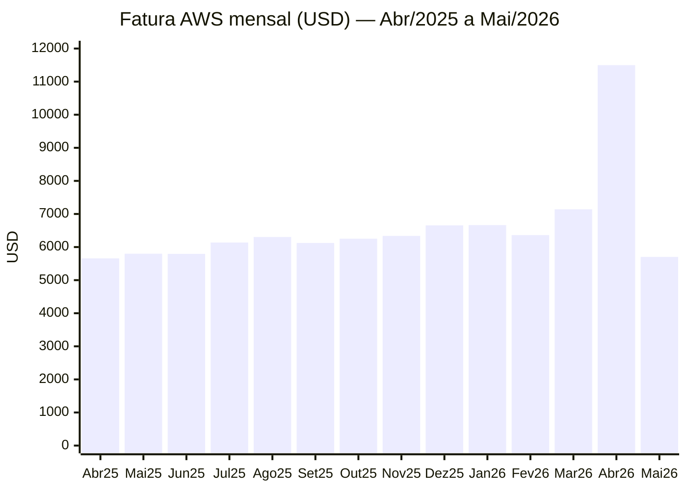
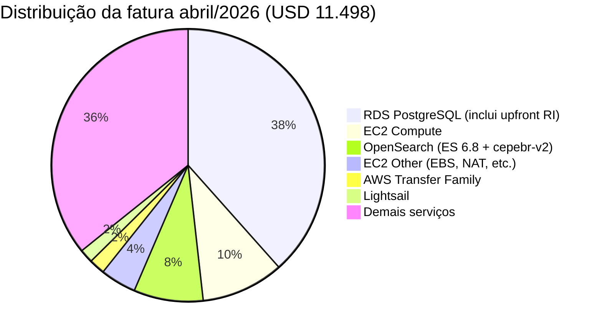
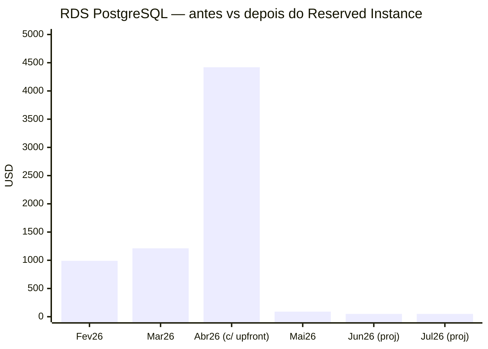
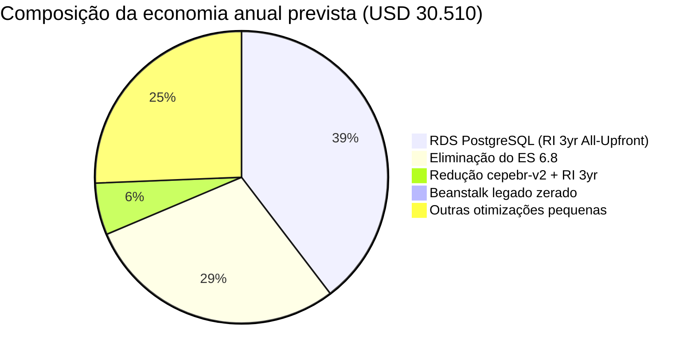
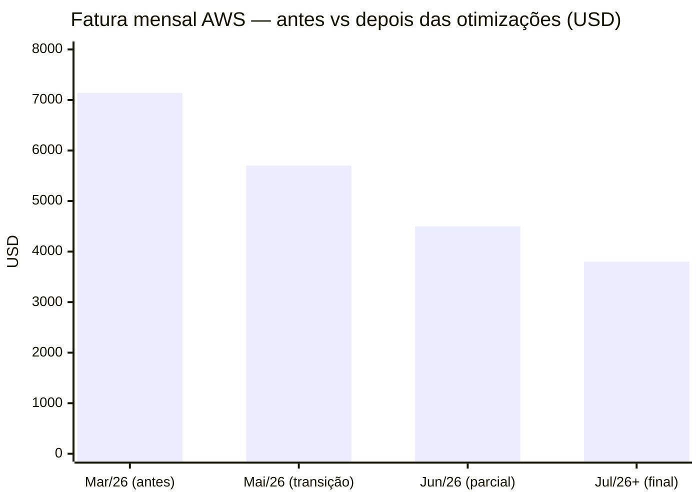
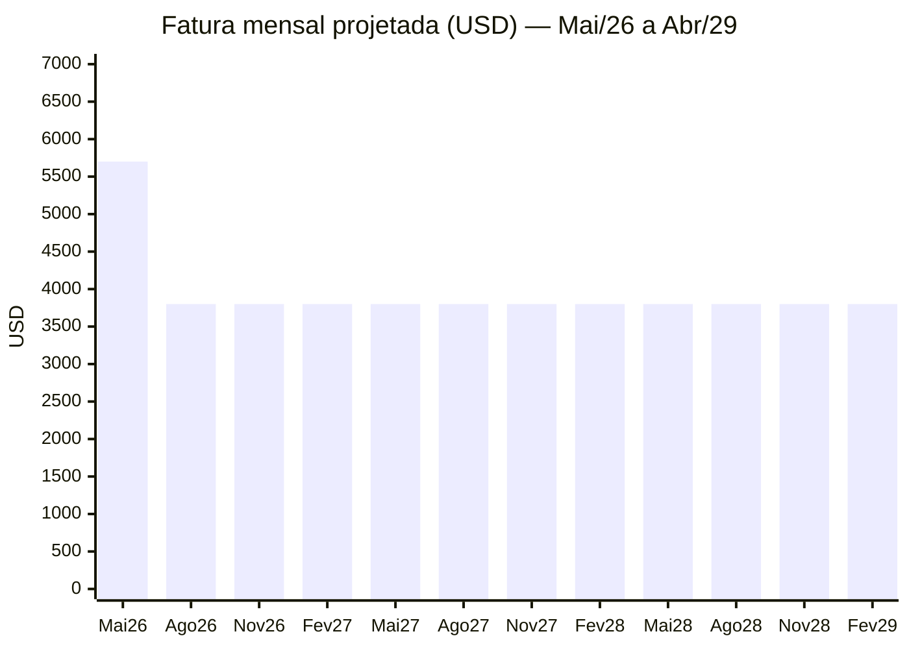

# Otimização da Infraestrutura AWS — Maio/2026

**Documento administrativo** | Direção Administrativa e Financeira
**Período de execução:** Abril e Maio de 2026
**Última atualização:** 05/05/2026

---

## Resumo Executivo

Em abril e maio de 2026 a equipe de TI executou um conjunto de ações de redução de custo na infraestrutura AWS que, somadas, **reduzirão a fatura mensal recorrente em aproximadamente 60%** a partir de junho/2026.

| Indicador | Valor |
|---|---|
| Fatura média mensal antes (mar/26 ref.) | **US$ 7.141** |
| Fatura abril/2026 (com upfront RDS) | US$ 11.498 |
| Fatura maio/2026 (forecast) | **US$ 5.701** |
| Fatura projetada junho/2026 em diante | **US$ ~3.800** |
| **Economia anual estimada** | **~US$ 30.000** |
| **Economia em 3 anos (vida do RI RDS)** | **~US$ 90.000 (≈ R$ 495 mil)** |

A maior parcela da economia vem de duas decisões estruturais:

1. **Compra de Reserved Instance (RI) do RDS PostgreSQL** — desembolso único de **US$ 3.300** que zera o custo recorrente do banco por **3 anos**.
2. **Eliminação do cluster Elasticsearch 6.8 (`cepebr`)** — economia recorrente de **US$ 731/mês**.

---

## Histórico de Custos AWS (últimos 14 meses)



> **Observação:** Abril/2026 contém o desembolso único de US$ 3.300 do **upfront do Reserved Instance RDS**, que cobre 3 anos. Excluindo esse upfront, abril fecharia em ~US$ 8.198. A partir de maio, o RDS passa a custar próximo de zero.

---

## Composição da Fatura — Abril/2026 (último mês fechado)



---

## Ações Executadas

### 📅 Linha do tempo

```mermaid
gantt
    title Ações de otimização AWS — 2026
    dateFormat YYYY-MM-DD
    axisFormat %d/%m
    section Banco de Dados
    Compra de Reserved Instance RDS (3yr All-Upfront)  :done, rds, 2026-04-25, 1d
    section OpenSearch
    Migração de dados ES6.8 -> OpenSearch 2.13         :done, mig, 2026-04-29, 6d
    Snapshot pre-deleção do ES 6.8                     :done, snap, 2026-05-05, 1h
    Exclusão do cluster cepebr (ES 6.8)                :done, del, 2026-05-05, 1h
    section Aplicações Legadas
    Beanstalk cepe-elastic-ingestor zerado             :done, eb, 2026-05-04, 1d
    section Pendências
    Reduzir cepebr-v2 (3-AZ -> 1-AZ single-node)       :pend, p1, 2026-05-06, 1d
    Comprar RI 3-yr No-Upfront para cepebr-v2          :pend, p2, after p1, 1d
```

---

### 1. Compra de Reserved Instance — RDS PostgreSQL

**O que é:** Em vez de pagar o RDS hora-a-hora (on-demand), foi comprado um **compromisso de 3 anos**, com **desembolso único** (All Upfront), que dá direito ao uso da capacidade por todo esse período sem cobranças adicionais.

| Item | Valor |
|---|---|
| Tipo de instância | `db.t4g.large` (Graviton, ARM) |
| Quantidade | 2 instâncias |
| Período | 3 anos (até abril/2029) |
| Pagamento | All Upfront — US$ 1.650 × 2 = **US$ 3.300** |
| Custo recorrente | **US$ 0,00/h** durante todo o período |

**Impacto financeiro:**



A partir de **maio/2026**, o RDS PostgreSQL deixa de pesar na fatura recorrente. A economia em 3 anos (vs uso on-demand) é de aproximadamente **US$ 36.000**.

---

### 2. Eliminação do Cluster Elasticsearch 6.8

**Contexto:** O cluster `cepebr` (Elasticsearch 6.8) era o motor de busca legado do SDOE. Após a migração das aplicações Java (e do indexador Node) para o OpenSearch 2.13 (`cepebr-v2`), o `cepebr` permanecia rodando sem ninguém escrever nele — apenas consumindo recursos.

**Ação:** Snapshot completo dos 596 índices (2.958 shards, 25,9 GB) salvo no bucket S3 `esnovo` para restauração futura caso necessário, seguido da exclusão do domínio.

| Item | Valor |
|---|---|
| Cluster | `cepebr` (Elasticsearch 6.8) |
| Configuração | 3× r5.large.elasticsearch (data) + 3× i4i.large.elasticsearch (master) + 450 GB EBS |
| Custo mensal antes | **~US$ 731** |
| Snapshot | 596 índices, 0 falhas, gravado em `s3://esnovo/snap-pre-delete-20260505` |
| Custo mensal depois | **US$ 0** |
| **Economia anual** | **~US$ 8.770** (≈ R$ 48.200) |

**Mitigação de risco:** o snapshot íntegro permite, se algum sistema esquecido precisar, criar um novo cluster pequeno (ex.: t4g.medium em 1 nó) apontado para o mesmo bucket e restaurar em poucas horas.

---

### 3. Beanstalk legado zerado

**Contexto:** O ambiente Elastic Beanstalk `cepe-elastic-ingestor-prd` era o ingestor Java antigo de matérias para o ES 6.8. Substituído pelo novo indexador Node, mas o ambiente continuava ligado por inércia — uma instância `t3.micro` continuamente sendo recriada pelo Auto Scaling Group sempre que era desligada.

**Ação:** Reduzido o ASG para `min=0, desired=0`, instância detached e parada. O ambiente Beanstalk permanece existindo (sem custo de instância) e pode ser terminado definitivamente após confirmação adicional.

| Item | Valor |
|---|---|
| Custo mensal antes | ~US$ 15-25 |
| Custo mensal depois | US$ 0 |

---

### 4. Pendência — Redução do `cepebr-v2`

**O que falta fazer:** O cluster OpenSearch ativo `cepebr-v2` está provisionado em alta disponibilidade (3 nós × 3 zonas de disponibilidade), o que é desnecessário para o perfil de uso atual da busca eletrônica do SDOE — que tem **dois caminhos de fallback** (PDF e DocPro), tornando o impacto de eventual indisponibilidade da busca eletrônica baixo.

**Plano:**
1. Reduzir para configuração **single-node, single-AZ** com instância `m7g.large.search` (geração atual, ARM/Graviton)
2. Comprar **Reserved Instance de 3 anos sem desembolso inicial** (No Upfront)

| Configuração | Custo mensal |
|---|---|
| Atual (3 nós × 3 AZ) | ~US$ 203 |
| Proposta (1 nó single-AZ, on-demand) | ~US$ 76 |
| Proposta com RI 3yr No-Upfront | **~US$ 58** |

**Economia adicional prevista:** ~US$ 145/mês = **US$ 1.740/ano**.

---

## Origem da Economia Anual Consolidada



> Observação: a parcela "RDS RI" considera apenas a economia de uso recorrente (não o desembolso inicial). Em 3 anos a economia bruta do RDS é maior que US$ 36.000.

---

## Comparativo Antes × Depois



| Cenário | Mensal | Anual |
|---|---|---|
| Antes (média) | US$ 7.141 | US$ 85.692 |
| Maio/2026 (transição) | US$ 5.701 | — |
| Junho/2026 em diante (estimado) | **US$ 3.800** | **US$ 45.600** |
| **Economia anual** | **US$ 3.341/mês** | **~US$ 40.000** |

---

## Projeção 36 meses (vida útil dos Reserved Instances)



| Período | Custo total estimado |
|---|---|
| Trajetória atual (sem otimizações) | ~US$ 240.000 |
| Após otimizações executadas | ~US$ 140.000 |
| **Economia em 3 anos** | **~US$ 100.000 (≈ R$ 550 mil)** |

---

## Riscos e Mitigações

| Risco | Probabilidade | Mitigação |
|---|---|---|
| Algum sistema esquecido depender do ES 6.8 | Baixa | Snapshot íntegro guardado em `s3://esnovo` — restauração em poucas horas |
| Indisponibilidade momentânea da busca eletrônica do SDOE durante swap de alias | Baixa | Realizado swap atômico em produção sem janela de inconsistência |
| RI RDS não cobrir crescimento futuro | Média | Tipo `db.t4g.large` cobre projeção atual; aumento exigirá nova RI ou complemento on-demand |
| Single-node OpenSearch ter falha de hardware | Média | Aceito porque o SDOE tem **3 caminhos de busca**: eletrônica, PDF e DocPro (apenas a eletrônica seria afetada) |
| Crescimento de uso aumentar custos | Média | Alarmes de billing já configurados; revisão trimestral planejada |

---

## Próximos Passos (a executar em maio/2026)

| # | Ação | Prazo | Responsável |
|---|---|---|---|
| 1 | Reduzir cluster `cepebr-v2` para single-node single-AZ com `m7g.large.search` | Após conclusão do reindex em curso | TI |
| 2 | Comprar RI 3-yr No-Upfront para `cepebr-v2` | Imediatamente após passo 1 | TI |
| 3 | Confirmar com equipe Java que nenhum sistema lê do ES 6.8 (validação adicional) | Próximos 7 dias | TI + Equipe Java |
| 4 | Decidir destino final do ambiente Beanstalk legado (terminar ou manter zerado) | Após confirmação | TI |
| 5 | Revisar mensalmente a fatura no Cost Explorer | Mensal | TI / Financeiro |

---

## Anexos Técnicos

- **Snapshot ES 6.8:** `s3://esnovo/snap-pre-delete-20260505` (596 índices, 0 falhas, 13min50s de duração)
- **Cluster ativo:** `cepebr-v2` (OpenSearch 2.13, índice `publicacoes_unificado_v2` com alias `publicacoes_unificado`)
- **Reserved Instances ativas:**
  - RDS: 2× `db.t4g.large` 3-yr All-Upfront (até abr/2029)
  - OpenSearch: a contratar (1× `m7g.large.search` 3-yr No-Upfront)

---

*Documento gerado em 05/05/2026 com dados extraídos do AWS Cost Explorer.*
