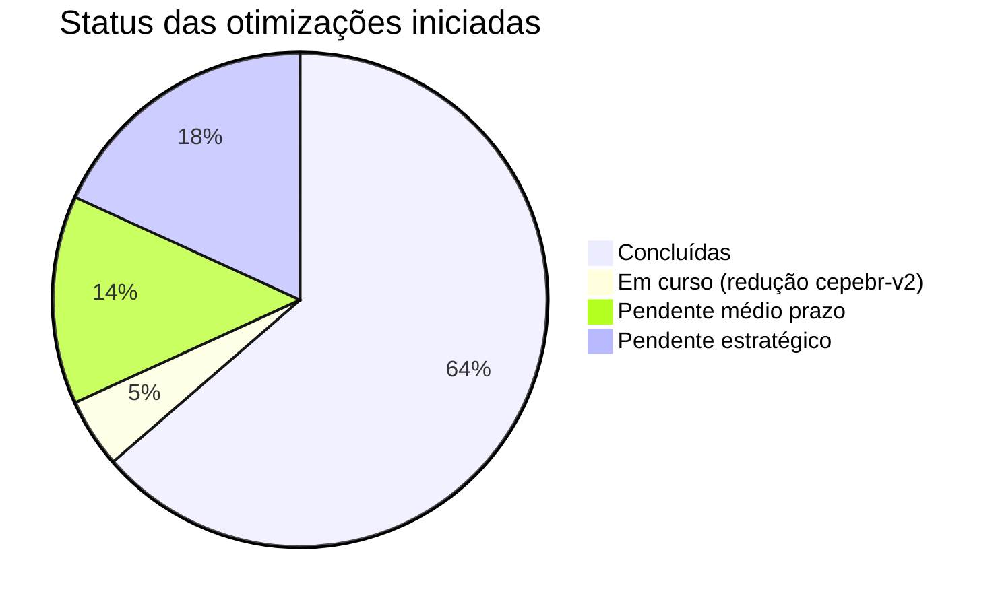
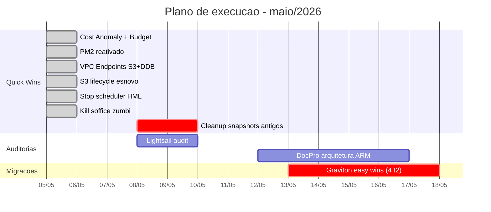
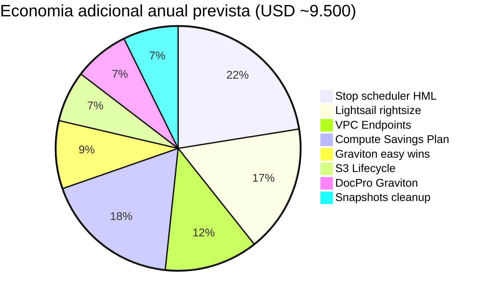
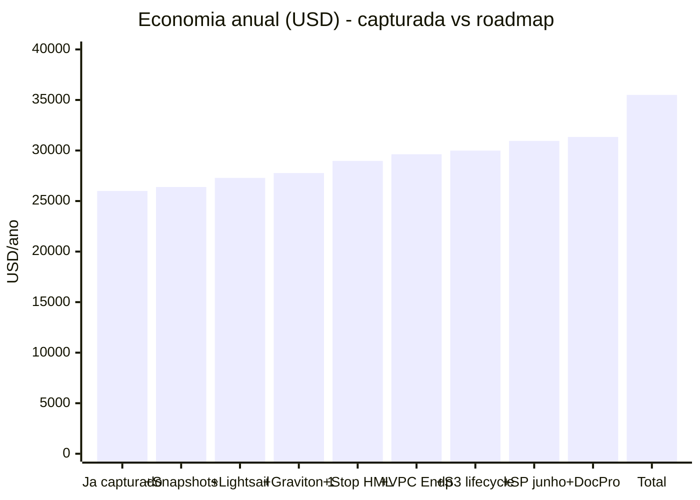
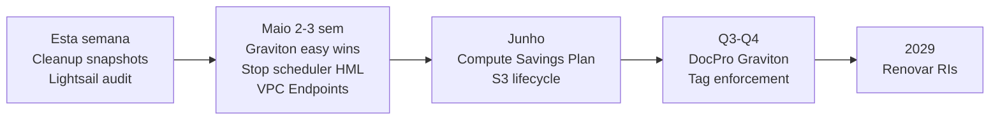

# Roadmap de Otimização AWS — Próximas Etapas

**Documento de planejamento** | TI / Direção Administrativa e Financeira
**Data:** 05/05/2026
**Documento relacionado:** [OTIMIZACAO_INFRA_AWS_2026.md](OTIMIZACAO_INFRA_AWS_2026.md) (ações já executadas)

---

## Resumo

Após as ações executadas em 04-05/05/2026 (RI RDS, exclusão ES 6.8, Beanstalk, Transfer Family, redução cepebr-v2), restam oportunidades de otimização adicional estimadas em **~US$ 250-400/mês** = **~US$ 9.000-14.500/ano**.

Esse documento organiza o backlog em **médio prazo** (executável neste mês) e **estratégico** (próximos meses).

---

## Já Executado em 05/05/2026 (consolidação)

**Concluídas em 05/05/2026:**
- ✅ Cost Anomaly Detection (alerta anomalias por serviço, e-mail diário pra fernando.paranhos@gmail.com)
- ✅ AWS Budget (limite mensal US$ 6.500 com alertas em 80% / 100% / forecast)
- ✅ PM2 reativado (`indexar-materias`, `indexar-materias-cron`, `conferencia-cron`)
- ✅ Audit de waste AWS: zero EIPs órfãos, zero EBS volumes órfãos
- ✅ **VPC Gateway Endpoints S3 + DynamoDB** — criados em todas as 5 VPCs (10 endpoints, gratuito, corta tráfego NAT)
- ✅ **S3 Lifecycle no bucket `esnovo`** — snapshots ES envelhecem para Glacier IR (30d) e Deep Archive (365d)
- ✅ **EventBridge Scheduler para HML** — `SDOE_HML_030223` para automaticamente 22h-7h BRT em dias úteis e fins de semana inteiros (~70% off, economia ~$60/mês)
- ✅ Processo zumbi `soffice` (LibreOffice headless idle 2 dias) eliminado — liberou 1,6 GB RAM no servidor

---

## 🟢 Roadmap — Médio Prazo (este mês)

### 1. Limpeza de snapshots antigos

**Objetivo:** Remover EBS snapshots e AMIs antigas não usadas por nenhuma instância em execução.

| Item | Volume | Custo estimado |
|---|---|---|
| 3 snapshots > 180 dias identificados | 260 GB total | ~US$ 21/mês |
| AMIs órfãs | a auditar | ~US$ 5-15/mês |

**Risco:** Verificar se as AMIs são bases de criação ainda usadas (ex.: launch templates).

**Economia estimada:** **US$ 25-40/mês** = **US$ 300-480/ano**

---

### 2. Auditoria Lightsail

**Contexto:** Lightsail consumiu **US$ 188 em abril/2026**, mas não temos clareza de quais bundles estão ativos.

**Ações:**
1. Listar todos os Lightsail instances/databases/containers
2. Identificar uso real de cada um
3. Migrar workloads para EC2+t4g (mais barato com RI) ou desativar

**Economia estimada:** **US$ 50-100/mês** = **US$ 600-1.200/ano**

---

### 3. Migração Graviton — 4 Easy Wins

**Candidatos identificados (baixo risco):**

| Instância | Tipo atual | Sugerido | Por que é seguro |
|---|---|---|---|
| CEPEBR-PORTAL | t2.small | t4g.small | Aplicação web Linux comum |
| CEPEBR-OVPN-SDOE | t2.micro | t4g.micro | OpenVPN tem build ARM oficial |
| CEPEBR-CUSTODIA | t2.small | t4g.small | App custódia simples |
| CEPEBR-LIVRARIA | t2.xlarge | t4g.xlarge | Rever também rightsize (xlarge é grande) |

**Procedimento por instância (~30min cada):**
1. Snapshot da instância atual
2. Build/escolher AMI ARM equivalente (Amazon Linux 2023 arm64)
3. Lançar nova instância t4g + restaurar dados (rsync ou AMI próprio)
4. Validar
5. Switch DNS/EIP
6. Terminar a antiga após X dias de observação

**Não migrar:**
- ❌ CEPEBR-RN-SDOE — Windows (ARM tem suporte parcial, alto risco)
- ❌ CEPEBR-DOCPRO — depende do fornecedor ter binário ARM
- ❌ CEPE-NEXUS-PITANG — depende do que o app Pitang precisa

**Economia estimada:** **US$ 30-50/mês** = **US$ 360-600/ano**

---

### 4. Stop Scheduler para ambientes HML/dev

**Contexto:** Algumas instâncias rodam 24/7 mas só são usadas em horário comercial:
- `SDOE_HML_030223` (r5.large, ambiente de homologação)
- Possivelmente `CEPE-IA`, `CEPE-IA-CDK-HOMOLOG` (já estão stopped, manter)

**Solução:** Lambda + EventBridge schedule para parar 22h-7h e fins de semana.

**Disponibilidade:** ~48h/semana ligado vs 168h/semana = **redução de ~70%**.

**Economia estimada:** **US$ 80-120/mês** = **US$ 960-1.440/ano**

---

### 5. VPC Endpoints para S3 e DynamoDB

**Contexto:** Tráfego entre EC2 e S3 que passa pela internet usa NAT Gateway, custando **~US$ 0,045/GB**. VPC Gateway Endpoints S3 e DynamoDB são **gratuitos** e cortam esse tráfego.

**Economia estimada:** **US$ 30-80/mês** = **US$ 360-960/ano** (depende do volume de I/O ao S3)

**Risco:** Trivial — só adicionar endpoint na VPC, roteamento automático.

---

### 6. S3 Lifecycle Policies

**Contexto:** Buckets como `cepebr-prod`, `cepebr-deirn-dados-ati`, `cepebr-snowboll`, `esnovo` acumulam objetos. Lifecycle pode automaticamente mover dados antigos para classes mais baratas:

| Storage class | Custo $/GB-mo | Latência |
|---|---|---|
| S3 Standard | $0,023 | ms |
| S3 Standard-IA (após 30d) | $0,0125 | ms |
| S3 Glacier Instant (após 90d) | $0,004 | ms |
| S3 Glacier Deep Archive (após 180d) | $0,00099 | horas |

**Economia estimada:** **US$ 20-40/mês** = **US$ 240-480/ano** (S3 atual = US$ 77/mês)

**Risco:** Trivial — políticas podem ser revertidas; só não acessar com latência baixa o que estiver em Glacier.

---

## 🔵 Roadmap — Estratégico (próximos meses)

### 7. Compute Savings Plan (junho/2026)

**Por que esperar:** A linha de base de uso EC2 caiu hoje após:
- Delete ES 6.8 (3 EC2s elasticsearch)
- Terminate Beanstalk ingestor
- Redução cepebr-v2

A recomendação atual da AWS (US$ 0,560/h) está superestimada — comprar agora resultaria em **over-commitment**.

**Estratégia:** Aguardar **30 dias de baseline pós-otimizações** e então recalcular. Provavelmente a recomendação cairá para **US$ 0,30-0,40/h**, ainda com retorno positivo.

**Economia estimada:** **US$ 60-100/mês** = **US$ 720-1.200/ano**

---

### 8. DocPro Graviton

**Ação:** Consultar fornecedor do DocPro se há build ARM/Graviton disponível. Se sim, migrar `CEPEBR-DOCPRO` (atualmente r6a.large = AMD) para r7g.large.

**Economia estimada:** **US$ 25-40/mês** = **US$ 300-480/ano**

---

### 9. Tag Enforcement

**Ação:** Política de TI exigindo que todo recurso novo tenha tags `Projeto`, `Ambiente`, `Owner`. Permite Cost Allocation Reports detalhados.

**Benefício:** Visibilidade de custo por projeto. Não economiza diretamente, mas habilita decisões.

---

### 10. Calendário de Vencimento dos Reserved Instances

| RI | Tipo | Vencimento | Ação |
|---|---|---|---|
| RDS PostgreSQL | 2× db.t4g.large All-Upfront | abr/2029 | Avaliar renovação 60 dias antes |
| OpenSearch cepebr-v2 | 1× m7g.large.search No-Upfront | mai/2029 | Avaliar renovação 60 dias antes |

**Lembrete:** Configurar reminder no calendário compartilhado da TI para 01/02/2029 e 01/03/2029.

---

## 🟣 Higiene Operacional (indexador-sdoe)

| # | Ação | Benefício |
|---|---|---|
| 11 | Enviar `falhas-actionable-v2.csv` ao João (17 matérias S3 missing) | Fechar gap residual de indexação |
| 12 | Apagar backups `.bkp-*` em `/opt/indexador-sdoe` no servidor | Limpar disco |
| 13 | Transformar `/opt/indexador-sdoe` em git repo (init + remote) | Versionamento e auditoria |
| 14 | Investigar processo `soffice` órfão (PID 14992) consumindo 1,6 GB RAM | Estabilidade |
| 15 | Documentar `swap-alias.sh` como procedimento padrão | Reuso futuro |

---

## Consolidado da Economia Adicional (após backlog completo)

**Soma esperada:** **~US$ 9.500/ano = ~US$ 28.500 em 3 anos = ~R$ 156 mil**.

Somando ao já capturado (~US$ 26.000/ano), o total de economia anual chega a **~US$ 35.000-36.000** = **~US$ 105.000 em 3 anos** ≈ **R$ 580 mil**.

---

## Comparativo: Já Capturado × Roadmap

---

## Priorização Recomendada

---

## Monitoramento

A partir de hoje, todo desvio será detectado automaticamente:

- **AWS Cost Anomaly Detection** — e-mail diário se algum serviço gastar US$ 50+ acima do baseline (`fernando.paranhos@gmail.com`)
- **AWS Budget** — alertas em 80% / 100% / forecast 100% do limite mensal de US$ 6.500
- **Revisão mensal** no Cost Explorer — verificar se a economia esperada está sendo capturada

---

*Documento gerado em 05/05/2026. Atualização sempre que ações forem executadas ou novas oportunidades identificadas.*
